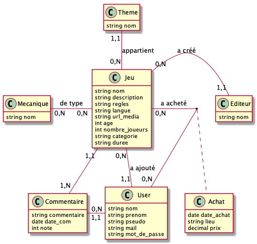

## Projet marathon 2020

Dans cette version du projet vous trouverez :

- Une application [laravel](https://laravel.com/)
- Le module d'authentification installé ([Tailwind CSS](https://tailwindcss.com/))
- Le framework [bootstrap](https://getbootstrap.com/)
- Les icons de la font d'icons [awesome](https://fontawesome.com/) (version free)

## Les commandes de départ

- `composer install`
- `cp .env.example .env`
- `php artisan key:generate`

Pour l'utilisation d'une base de données, vous devez modifier votre fichier `.env` et indiquer les informations de connexion vers votre base de données.

- `php artisan migrate:fresh`
- `php artisan db:seed`

Pour le front

- `npm install`
- `npm run dev`

Si vous avez des erreurs à la compilation du front (`npm run dev`), vous devez :

- Supprimer le répertoire `node_modules`
- Supprimer le fichier `package-lock.json`

et refaire les deux commandes précédentes

- `npm install`
- `npm run dev`

### Le modèle de données

<ul>
<li><strong>users</strong> : les différents utilisateurs enregistrés dans notre application.
</li>
<li><strong>jeux</strong> : les différentes jeex stockés dans la base. Le champ regles donne
    les règles du jeu. Le champ description donne une description du jeu. Le champ url_media donne un lien vers un média qui présente le jeu (photo, vidéo, ...).
    La relation "a ajouté" entre un utilisateur et un jeu indique l'identification de l'utilisateur ayant ajouté (créé) le jeu dans la base de données.
</li>
<li><strong>editeurs</strong> : Donne le nom de l'éditeur du jeu.</li>
<li><strong>themes</strong> : Donne le thème du jeu.</li>
<li><strong>mecaniquse</strong> : Donne une liste de mécaniques utilisées par le jeu.</li>
<li><strong>commentaires</strong> : les utilisateurs peuvent donner un commentaire  sur un
    jeu. L'utilisateur ne peut donner qu'un seul commentaire sur un jeu, il faudra donc interdire la création d'un nouveau commentaire sur un jeu par le même utilisateur.
    L'utilisateur peut donner une note entre 0 et 5 au jeu en plus du commentaire.
    Il y a donc deux clés étrangères permettant de connaitre l'utilisateur et le jeu.
</li>
<li><strong>achats</strong> est une table pivot permettant de spécifier quand un utilisateur a acheté le jeu, où il est stocké et le prix d'achat.
</li>
</ul>

### La migration

- Les tables de la base de données vous sont données (voir le répertoire `database/migration`)
- Les classes pour ajouter des données aléatoires sont données (voir le répertoire `database/seeders`)

### Votre travail

Après avoir lancer l'application, l'énoncé sera disponible à l'adresse http://localhost:8000/enonce.

A partir de cette version initiale, vous devez réaliser les questions données dans le jalon 1 puis le jalon 2, jalon 3 et projet.

<ol>
<li>Le code de l'application (backend).</li>
<li>La charte graphique + logo puis intégration (frontend)</li>
<li>rédiger un avis sur un jeu (choisi librement)</li>
<li>la rédaction de règles du jeu en anglais. Attention au plagiat puisque nous passerons tous les textes au
    logiciel anti-plagiat, redoutablement efficace.
</li>
<li>la rédaction (en français) de vos choix relatifs au design.</li>
<li>Pendant le projet 3 jalons (Milestone) + 1 jalon projet</li>

<li>date fin jalon 1 : 16/12 à 14h (des tickets simples)</li>
<li>date fin jalon 2 : 17/12 à 10h (plus de travail)</li>
<li>date fin jalon 3 + jalon projet : 17/12 à 18h30</li>
</ol>

BON COURAGE !
